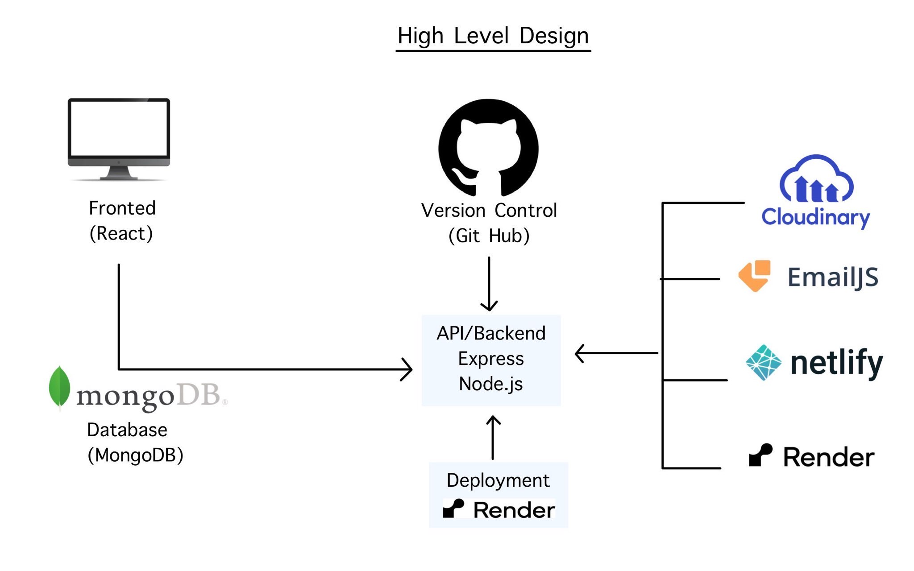
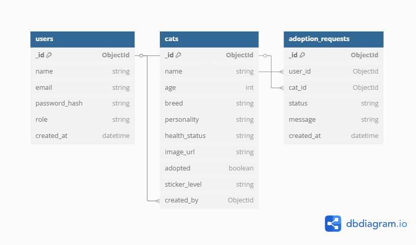

  Meowly

A web platform that connects adoptable cats with loving homes. Users can browse available cats, learn about their personalities, submit adoption applications, and receive updates on their application status.

Problem Statement
Many stray and abandoned cats are in need of loving homes, but there is a lack of centralized, user-friendly platforms that connect potential adopters with rescue shelters and foster homes. Current solutions are either outdated, cluttered, or limited in functionality. This gap makes it harder for people to discover adoptable cats, and for shelters to efficiently manage listings and applications.

Overview of the Application’s Functionality
Meowly is a web-based platform designed to streamline the cat adoption process in Vancouver. The application will allow local shelters and foster parents to create profiles for cats in need of adoption, including pictures, age, breed, personality traits, and health status. Users (potential adopters) will be able to browse available cats, filter results by preferences, and submit an adoption request form directly through the platform. The website will also feature educational resources about responsible cat adoption and care. Shelter administrators will have a dashboard to manage listings and respond to adoption applications efficiently. The goal is to make the adoption process smoother, faster, and more accessible for all users involved.

Technology Stack
Front-End:
HTML, CSS, JavaScript

React.js

Tailwind CSS or Bootstrap

Back-End:
Node.js with Express

MongoDB (using Mongoose)

RESTful API

Other Tools:
Git & GitHub for version control

Postman (for API testing)

Figma or Canva (for design mockups)

Netlify (for front-end deployment)

Render or Railway (for back-end deployment)

Features to be Implemented
Core Features:
User registration and login (adopters and shelter staff)

Browse and search available cats by category

Detailed cat profiles with images and descriptions

Adoption request form submission

Admin dashboard for shelter staff to add/edit/delete cat listings

Additional Features:
Filter by age, breed, and location

Email notifications for new applications

Resource blog for cat care tips

Mobile responsive design

User Stories
As a visitor, I want to browse available cats so that I can find a cat I would like to adopt.

As a registered user, I want to filter cats by age and breed so that I can find a pet that suits my preferences.

As a shelter admin, I want to add and edit cat profiles so that I can keep the adoption listings up to date.

As a visitor, I want to submit an adoption request so that I can apply to adopt a specific cat.

As a shelter admin, I want to view and manage adoption requests so that I can process them efficiently.

Additional Features to Elevate the Project
Image Uploads with Cloudinary: Instead of manually pasting image URLs, shelter staff can upload photos directly through the platform.

Email Notifications: Use Nodemailer or EmailJS to notify shelters when a new adoption request is submitted.

Request Status Management: Each adoption request can be marked as pending, approved, or rejected.

Mark as Adopted Button: Shelter admins can mark a cat as adopted, updating its status and visibility on the platform.

Google OAuth Login: Allow users to log in with their Google account for convenience.

Front-end and Back-end Validation: Ensure all forms have required fields and return helpful error messages to the user.

Educational Tips: A simple page with tips on cat care and the responsibilities of adoption.

## API Contract

### Authentication

All private endpoints require a valid JWT token in the header:
Authorization: Bearer <token>

---

### Users API

| Method | Endpoint        | Description               | Requires Auth | Body / Params                      |
|--------|------------------|---------------------------|----------------|-------------------------------------|
| POST   | /api/register    | Register new user         | No             | `{ name, email, password, role }`   |
| POST   | /api/login       | Authenticate user         | No             | `{ email, password }`               |
| GET    | /api/profile     | Get logged-in user's info | Yes            | -                                   |

---

### Cats API

| Method | Endpoint       | Description                    | Requires Auth | Body / Params                                                  |
|--------|----------------|--------------------------------|----------------|-----------------------------------------------------------------|
| GET    | /api/cats      | List all adoptable cats        | No             | Optional filters: `age`, `breed`, `sticker_level`               |
| GET    | /api/cats/:id  | Get details of a specific cat  | No             | `:id` in URL                                                    |
| POST   | /api/cats      | Create a new cat profile       | Yes (admin)    | `{ name, age, breed, personality, health_status, image_url, sticker_level }` |
| PUT    | /api/cats/:id  | Update a cat profile           | Yes (admin)    | `{ updated fields }`                                           |
| DELETE | /api/cats/:id  | Delete a cat profile           | Yes (admin)    | -                                                               |

---

### Adoption Requests API

| Method | Endpoint              | Description                           | Requires Auth | Body / Params                |
|--------|------------------------|---------------------------------------|----------------|-------------------------------|
| POST   | /api/requests          | Submit adoption request               | Yes            | `{ cat_id, message }`         |
| GET    | /api/requests/mine     | View my adoption requests             | Yes            | -                             |
| GET    | /api/requests          | View all requests (admin)             | Yes (admin)    | -                             |
| PUT    | /api/requests/:id      | Update request status (approve/reject)| Yes (admin)    | `{ status: "approved" }`      |

## Design References

These websites were used as visual and functional inspiration for the UI and features of Meowly:

- [Adopt A Pet](https://www.adoptapet.com/)
- [Petfinder](https://www.petfinder.com/)
- [Toronto Cat Rescue](https://www.torontocatrescue.ca/)
- [Rescate Felino Chile](https://rescatefelinochile.cl/adopta/)

## Diagrams

### High-Level Design

### Entity Relationship Diagram (ERD)

